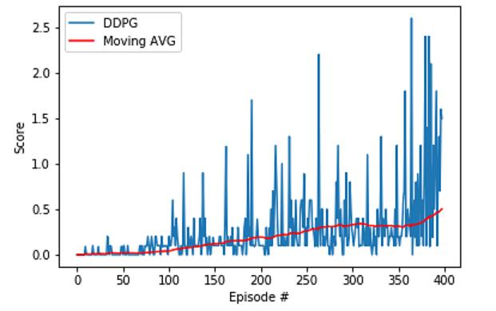

# Report

## Learning algorithm

This project uses the Deep Deterministic Policy Gradients (DDPG) algorithm as described in the [original paper](https://arxiv.org/pdf/1509.02971.pdf).

DDPG makes use of an actor and a critic to learn continuous actions. The actor learns how to act by directly estimating the optimal policy and maximizing reward through gradient ascent, and the critic generates Q-values for state-action pairs which are used to compute a temporal-difference (TD) error at each time step. The actor takes the current state as input and outputs one (or more) real values representing an action chosen from a continuous action space. The critic outputs an estimated Q-value given the current state and the actors action. DDPG also uses a replay buffer (experience replay) to sample batches of uncorrelated experiences for training. Additionally, we use the Ornstein–Uhlenbeck process to add noise to the actions. This encourages exploration of the action space.

In this project we uses the DDPG algorithm to solve the Tennis environment where two agents play tennis

### Newtork Architecture

DDPG uses two networks, one for the actor and one for the critic, each having three fully connected layers with dimensions and activations as follows:

#### Actor

| **Layer** | **Input Dimension** | **Output Dimension** | **Activation** |
|-----------|---------------------|----------------------|----------------|
| FC1       | 33 (state size)     | 512                  | Relu           |
| FC2       | 512                 | 256                  | Relu           |
| FC3       | 256                 |   (action size)      | Tanh           |

#### Critic

| **Layer** | **Input Dimension**  | **Output Dimension** | **Activation** |
|-----------|----------------------|----------------------|----------------|
| FC1       | 33 (state size)      | 512                  | Relu           |
| FC2       | 512 + 4 (action size)| 256                  | Relu           |
| FC3       | 256                  | 1 (Q-value)          | None           |

Both agents are sharing the same Buffer.

### Hyperparameters

The following hyperparameters were used during training:

| **Hyperparameter**       | **Value** | **Description**                                          |
|--------------------------|-----------|----------------------------------------------------------|
| Buffer Size              | 1e6       | Replay buffer size                                       |
| Batch Size               | 256       | Number of samples in a batch                             |
| Gamma                    | 0.99      | Future reward discount factor                            |
| Tau                      | 3e-3      | Soft update coefficient for target parameters            |
| Actor Learning Rate      | 1e-4      | Learning rate for the actor model                        |
| Critic Learning Rate     | 1e-3      | Learning rate for the critic model                       |
| Weight Decay             | 0.0       | Weight decay parameter for Adam optimizer                |
| Epsilon                  | 1.0       | Explore vs exploit noise factor                          |
| Epsilon Decay            | 1e-6      | Decay rate for epsilon                                   |
| Learn Every              | 1         | How often to perform soft update                         |
| Learn Num                | 10        | Number of steps (replay samples) to update over          |
| Grad Clipping            | 1.0       | Gradient Clipping                                        |
| OU Sigma                 | 0.10      | Standard deviation of the Ornstein-Uhlenbeck process     |
| OU Theta                 | 0.15      | Parameter of the Ornstein-Uhlenbeck process              |

Parameters for the networks can be found in the model.py and ddpg_agent.py

## Results

I found out that a slight change to the algorithm's hyperparameters causes a substantial difference in the results. 
After trying many combinations I discovered few interesting facts:
* Giving the Actor slower learning rate helped the convergence
* Higher batch sizes gave better performance (tried 32, 64, 128 and 256)
* Using a higher soft update coefficient Tau helped the model to converge 75% faster
* Batch normalization is very important

To my humble opinion the model performance is not satisfactory, because it's dependency on some of the hyperparameters and that's his weakness.
  

## Future Work

Testing different algorithms - In the original paper the authors discuss many algorithms which may receive better results for this task including TRPO and PILCO as well as other algorithm that were tested for this task like PPO, A3C and D4PG
